# AutoPlan AI — Detailed Project Report

**Project Title:** AutoPlan AI — Agentic Manufacturing Decision Support System  
**Technology Stack:** Python 3.11+, Google Gemini GenAI SDK, LangGraph, Pydantic, structlog  
**Domain:** Automotive Manufacturing Planning (Maruti Suzuki use case)  
**Date:** July 2026  

---

## Table of Contents

1. [Executive Summary](#1-executive-summary)
2. [System Architecture Overview](#2-system-architecture-overview)
3. [High-Level Workflow Flowchart](#3-high-level-workflow-flowchart)
4. [Directory Structure](#4-directory-structure)
5. [File-by-File Documentation](#5-file-by-file-documentation)
   - 5.1 [Entry Point — run_cli.py](#51-entry-point--run_clipy)
   - 5.2 [Application Layer — app/](#52-application-layer--app)
   - 5.3 [Framework Layer — framework/](#53-framework-layer--framework)
   - 5.4 [Agents Layer — agents/](#54-agents-layer--agents)
   - 5.5 [Tools Layer — tools/](#55-tools-layer--tools)
   - 5.6 [Skills Layer — skills/](#56-skills-layer--skills)
   - 5.7 [Prompts Layer — prompts/](#57-prompts-layer--prompts)
   - 5.8 [Guardrails Layer — guardrails/](#58-guardrails-layer--guardrails)
   - 5.9 [Data Layer — app/data/](#59-data-layer--appdata)
   - 5.10 [Tests Layer — tests/](#510-tests-layer--tests)
   - 5.11 [Configuration Files](#511-configuration-files)
6. [Detailed Flowcharts](#6-detailed-flowcharts)
7. [Design Patterns Used](#7-design-patterns-used)
8. [Data Flow Summary](#8-data-flow-summary)

---

## 1. Executive Summary

AutoPlan AI is an **agentic, multi-agent decision support system** designed for Maruti Suzuki's manufacturing operations. It accepts natural language queries from factory managers (e.g., *"What happens if we increase Brezza demand by 25%?"*) and produces validated strategic recommendations by autonomously:

1. **Classifying** the query as a planning task or general conversation.
2. **Decomposing** complex planning goals into ordered sub-tasks.
3. **Executing** each sub-task using specialized data tools (capacity, cost, inventory, supplier).
4. **Synthesizing** a strategic recommendation report from the collected data.
5. **Validating** the recommendation against business guardrails and safety policies.

The system uses **Google Gemini** as its LLM backbone and **LangGraph** for deterministic workflow orchestration.

---

## 2. System Architecture Overview

The project follows a **layered architecture** with clear separation of concerns:

| Layer | Directory | Responsibility |
|:------|:----------|:---------------|
| **Entry Point** | `run_cli.py` | CLI REPL loop for user interaction |
| **Application** | `app/` | Application orchestrator, config, data, API, frontend |
| **Framework** | `framework/` | LLM client, state management, tool registry, workflow graph, utilities |
| **Agents** | `agents/` | Node implementations (Router, Planner, Orchestrator, Strategy, Validator, Chatbot) |
| **Tools** | `tools/` | Executable data retrieval tools (capacity, cost, inventory, supplier, search, weather, skill loader) |
| **Skills** | `skills/` | Domain expert prompt templates (production analyst, financial analyst) |
| **Prompts** | `prompts/` | System instruction markdown files for each agent |
| **Guardrails** | `guardrails/` | Business and safety validation rule documents |
| **Data** | `app/data/` | CSV datasets (vehicles, costs, inventory, suppliers) |
| **Tests** | `tests/` | Unit test suites |

---

## 3. High-Level Workflow Flowchart

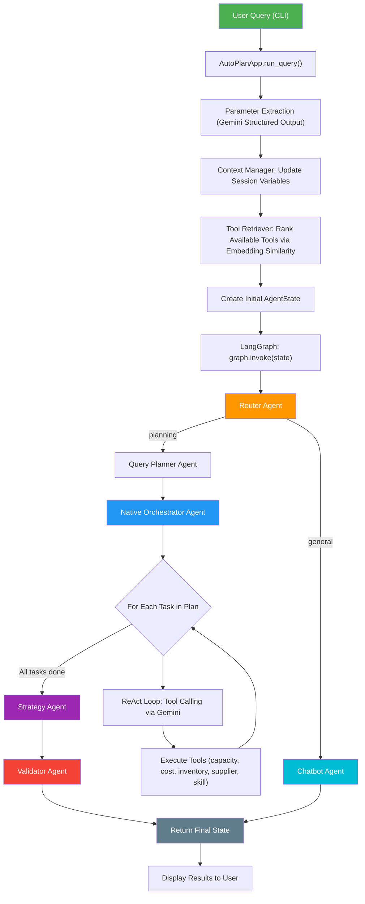

---

## 4. Directory Structure

```
maruti iteration 1/
├── run_cli.py                          # CLI entry point (REPL)
├── requirements.txt                    # Python dependencies
├── .env                                # Environment variables (API keys)
├── .tool_vector_cache.json             # Cached tool/skill embedding vectors
│
├── app/                                # Application layer
│   ├── __init__.py
│   ├── config.py                       # Global configuration and paths
│   ├── app.py                          # Main AutoPlanApp orchestrator class
│   ├── data/                           # CSV and PDF datasets
│   │   ├── vehicles.csv
│   │   ├── costs.csv
│   │   ├── inventory.csv
│   │   ├── suppliers.csv
│   │   └── maruti_safety_policy.pdf    # Maruti Suzuki Safety Policy manual (PDF)
│   ├── api/                            # REST API (FastAPI)
│   └── frontend/                       # Streamlit web frontend
│
│── framework/                          # Core framework layer
│   ├── llm/
│   │   ├── gemini_client.py            # Gemini GenAI SDK wrapper
│   │   └── prompts.py                  # Fallback prompt strings
│   ├── state/
│   │   └── state.py                    # AgentState TypedDict + state factory
│   ├── context/
│   │   └── context_manager.py          # Conversational memory manager
│   ├── registry/
│   │   ├── tool_registry.py            # BaseTool ABC + ToolRegistry catalog
│   │   ├── registry_loader.py          # Dynamic tool module scanner
│   │   └── retriever.py               # Embedding-based tool/skill retriever
│   ├── workflow/
│   │   ├── graph.py                    # LangGraph workflow builder + routing
│   │   └── executor.py                 # Parallel tool execution handler
│   └── utils/
│       ├── exceptions.py               # Custom exception hierarchy
│       ├── helpers.py                  # JSON parsing + prompt loader utilities
│       └── logger.py                   # structlog logging configuration
│
├── agents/                             # Agent node implementations
│   ├── base_agent.py                   # Abstract BaseAgent interface
│   ├── router_agent.py                 # Query classifier (planning vs general)
│   ├── query_planner.py                # Task decomposition planner
│   ├── native_orchestrator_agent.py    # ReAct tool execution orchestrator
│   ├── strategy_agent.py              # Strategic recommendation synthesizer
│   ├── validator_agent.py             # Guardrail validation auditor
│   └── chatbot_agent.py               # General conversation responder
│
├── tools/                              # Executable tool implementations
│   ├── capacity_tool.py                # Vehicle capacity utilization calculator
│   ├── cost_tool.py                    # Cost and overtime expense estimator
│   ├── inventory_tool.py              # Parts stock shortage checker
│   ├── supplier_tool.py               # Supplier risk and lead time querier
│   ├── pdf_search_tool.py              # PDF RAG search tool for Safety Manual
│   ├── search_tool.py                 # DuckDuckGo web search tool
│   ├── weather_tool.py                # Weather forecast stub tool
│   └── load_skill_tool.py             # Dynamic skill/persona loader
│
├── skills/                             # Domain expert prompt templates
│   ├── production_analyst.md           # Manufacturing capacity expert
│   └── financial_analyst.md            # Cost and budget optimization expert
│
├── prompts/                            # Agent system instruction files
│   ├── router.md
│   ├── query_planner.md
│   ├── orchestrator.md
│   ├── strategy.md
│   ├── validator.md
│   ├── chatbot.md
│   ├── parameter_extractor.md
│   ├── planner.md
│   └── prompt.md                       # Master prompt documentation
│
├── guardrails/                         # Validation policy documents
│   ├── business_guardrails.md
│   └── safety_guardrails.md
│
└── tests/                              # Unit test suites
    ├── test_framework.py
    ├── test_guardrails.py
    ├── test_planner.py
    ├── test_router.py
    ├── test_skill_retriever.py
    ├── test_skills.py
    └── test_pdf_search.py              # Unit tests for PDF RAG Tool

```

---

## 5. File-by-File Documentation

---

### 5.1 Entry Point — run_cli.py

#### File: `run_cli.py`

| Attribute | Details |
|:----------|:--------|
| **Purpose** | Provides the interactive CLI (Read-Eval-Print Loop) for users to query the AutoPlan AI system |
| **Lines of Code** | ~85 |
| **Who calls it** | The user runs it directly: `python run_cli.py` |
| **Who it calls** | `AutoPlanApp` from `app/app.py` |
| **Design Pattern** | REPL (Read-Eval-Print Loop) Pattern |

**What it does:**
1. Instantiates `AutoPlanApp()`, which boots the entire framework (Gemini client, tool registry, memory manager, LangGraph workflow).
2. Enters an infinite loop, reading user input from `stdin`.
3. Passes each query to `app.run_query(query)`.
4. Extracts and prints the `recommendation`, `validation_status`, and `execution_trace` from the returned state.
5. Handles special commands: `quit`/`exit` to terminate, `reset` to clear memory.

**Data Flow:**
```
User Input (stdin) → AutoPlanApp.run_query() → Print Results (stdout)
```

---

### 5.2 Application Layer — app/

#### File: `app/config.py`

| Attribute | Details |
|:----------|:--------|
| **Purpose** | Centralizes all configuration settings, file paths, and environment variables |
| **Lines of Code** | 41 |
| **Who calls it** | Every module in the project imports path constants and API keys from here |
| **Design Pattern** | Singleton Configuration Pattern |

**Key Constants Defined:**

| Constant | Value | Purpose |
|:---------|:------|:--------|
| `WORKSPACE_ROOT` | Parent of `app/` directory | Root project path |
| `DATA_DIR` | `app/data/` | CSV dataset directory |
| `VEHICLES_CSV` | `app/data/vehicles.csv` | Vehicle production data path |
| `INVENTORY_CSV` | `app/data/inventory.csv` | Parts inventory data path |
| `SUPPLIERS_CSV` | `app/data/suppliers.csv` | Supplier metrics data path |
| `COSTS_CSV` | `app/data/costs.csv` | Cost and overtime rates path |
| `GEMINI_API_KEY` | From `.env` | Google Gemini API key |
| `DEFAULT_MODEL` | `gemini-2.5-flash` | Default LLM model name |

**What it does:**
1. Resolves `WORKSPACE_ROOT` using `Path(__file__).resolve().parent.parent`.
2. Appends `framework/` and `app/` to `sys.path` for seamless imports.
3. Calls `load_dotenv()` to load environment variables from `.env`.
4. Defines all CSV file path constants used by tools.

---

#### File: `app/app.py`

| Attribute | Details |
|:----------|:--------|
| **Purpose** | Main application orchestrator that initializes all subsystems and runs queries end-to-end |
| **Lines of Code** | 161 |
| **Who calls it** | `run_cli.py` |
| **Who it calls** | `GeminiClient`, `ContextManager`, `ToolRegistry`, `ToolRetriever`, `SkillRetriever`, `build_workflow`, `create_initial_state` |
| **Design Pattern** | Facade Pattern |

**Classes Defined:**

| Class | Purpose |
|:------|:--------|
| `VehicleAdjustment` | Pydantic model for a single vehicle demand change (vehicle name + percentage) |
| `QueryContextVariables` | Pydantic schema for LLM-extracted context parameters (adjustments list + overtime flag) |
| `AutoPlanApp` | Main application facade that orchestrates the entire pipeline |

**AutoPlanApp Lifecycle:**

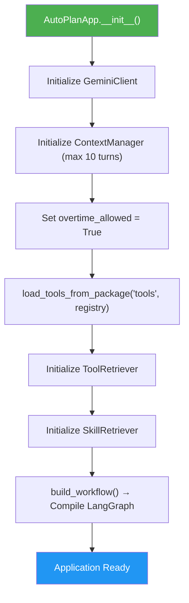

**`run_query(query)` Pipeline:**

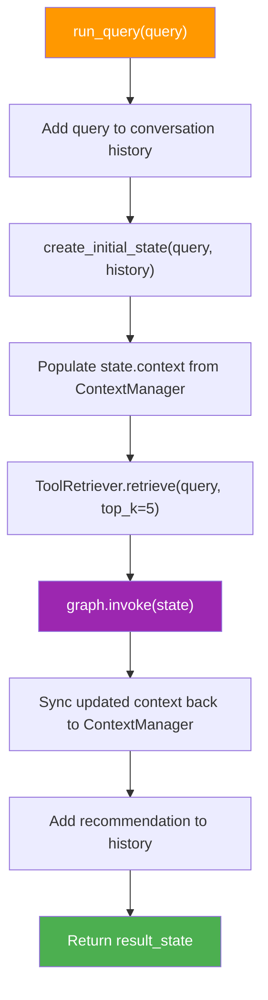

**`_extract_query_parameters(query, history)` Method:**
- Loads the `parameter_extractor.md` system prompt.
- Sends the last 4 history turns + the current query to Gemini with structured output mode.
- Uses `QueryContextVariables` Pydantic schema to parse the LLM response.
- Returns extracted variables (vehicle adjustments, overtime settings).

---

### 5.3 Framework Layer — framework/

#### File: `framework/llm/gemini_client.py`

| Attribute | Details |
|:----------|:--------|
| **Purpose** | Wraps the Google GenAI SDK to provide unified text generation and structured output methods |
| **Lines of Code** | ~120 |
| **Who calls it** | All agents, the application orchestrator, and the retriever |
| **Design Pattern** | Adapter/Wrapper Pattern |

**Key Methods:**

| Method | Input | Output | Purpose |
|:-------|:------|:-------|:--------|
| `generate(prompt, model, temperature, system_instruction)` | Prompt string | Text string | Free-form text generation |
| `generate_structured(prompt, response_schema, system_instruction, temperature)` | Prompt + Pydantic schema | Parsed Pydantic model | Structured JSON generation with schema enforcement |
| `get_embedding(text)` | Text string | List of floats (768-dim vector) | Generates text embeddings for similarity search |

**How structured output works:**
1. Converts a Pydantic model class to a JSON schema dictionary.
2. Passes the schema as `response_mime_type="application/json"` + `response_schema` to the Gemini API.
3. Parses the JSON response back into a Pydantic model instance.
4. This forces the LLM to return data in an exact, predictable structure.

---

#### File: `framework/llm/prompts.py`

| Attribute | Details |
|:----------|:--------|
| **Purpose** | Stores hardcoded fallback prompt strings for agents when markdown prompt files are missing |
| **Lines of Code** | ~60 |
| **Who calls it** | Agents use these as defaults when `load_prompt()` cannot find the corresponding `.md` file |
| **Design Pattern** | Constants / Default Values Pattern |

**Fallback Prompts Defined:**
- `STRATEGY_PROMPT` — Strategy agent instructions
- `VALIDATOR_PROMPT` — Validator agent instructions
- `ROUTER_PROMPT` — Router agent classification instructions

---

#### File: `framework/state/state.py`

| Attribute | Details |
|:----------|:--------|
| **Purpose** | Defines the shared `AgentState` TypedDict schema that flows through all LangGraph nodes |
| **Lines of Code** | ~50 |
| **Who calls it** | `app.py` creates the initial state; every agent reads/writes to it |
| **Design Pattern** | Shared State / Blackboard Pattern |

**AgentState Fields:**

| Field | Type | Purpose |
|:------|:-----|:--------|
| `query` | `str` | The original user query |
| `conversation_history` | `List[Dict]` | Previous chat messages |
| `route_decision` | `str` | Router classification: `"planning"` or `"general"` |
| `execution_plan` | `Dict` | Structured task plan from the Query Planner |
| `task_results` | `Dict` | Raw data collected by the orchestrator's tool executions |
| `recommendation` | `str` | Final strategic report from Strategy Agent |
| `validation_status` | `str` | `"PASSED"` or `"FAILED"` from Validator Agent |
| `validation_feedback` | `str` | Detailed validation notes |
| `context` | `Dict` | Active session variables (adjustments, overtime flag) |
| `available_tools` | `List[Dict]` | Tools ranked by embedding similarity for this query |
| `execution_trace` | `List[Dict]` | Audit trail of all agent actions and tool calls |

**State Lifecycle Flowchart:**

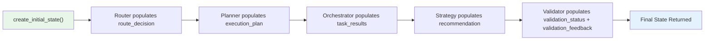

---

#### File: `framework/context/context_manager.py`

| Attribute | Details |
|:----------|:--------|
| **Purpose** | Manages conversational memory: chat history and session variables (like ChatGPT-style memory) |
| **Lines of Code** | ~70 |
| **Who calls it** | `AutoPlanApp` uses it to track multi-turn conversations |
| **Design Pattern** | Session Manager / Memory Pattern |

**Key Methods:**

| Method | Purpose |
|:-------|:--------|
| `add_message(role, content)` | Appends a user/assistant message to history |
| `get_history()` | Returns the conversation history (capped at `max_history_turns`) |
| `get_variables()` | Returns the current session variables dictionary |
| `update_variables(new_vars)` | Merges new variables into the session |
| `clear()` | Resets both history and variables |

**How it maintains context across turns:**
- When the user says *"What if overtime is allowed?"*, the parameter extractor extracts `overtime_allowed=True`.
- The ContextManager stores this in `session_variables`.
- On the next query, this variable persists automatically — tools will read `overtime_allowed=True` from the context without the user repeating it.

---

#### File: `framework/registry/tool_registry.py`

| Attribute | Details |
|:----------|:--------|
| **Purpose** | Defines the `BaseTool` abstract class and `ToolRegistry` catalog for dynamic tool management |
| **Lines of Code** | ~90 |
| **Who calls it** | All tools inherit from `BaseTool`; the registry is used by the orchestrator and retriever |
| **Design Pattern** | Abstract Factory + Registry Pattern |

**`BaseTool` Abstract Class:**

| Attribute | Type | Purpose |
|:----------|:-----|:--------|
| `name` | `str` | Unique tool identifier (e.g., `"capacity_tool"`) |
| `description` | `str` | Natural language description for LLM tool selection |
| `version` | `str` | Semantic version string |
| `category` | `str` | Category tag (e.g., `"manufacturing"`, `"general"`) |
| `tags` | `List[str]` | Search keywords for embedding-based retrieval |
| `execute(state)` | Abstract method | The actual tool logic — must be implemented by subclasses |

**`ToolRegistry` Class:**

| Method | Purpose |
|:-------|:--------|
| `register(tool)` | Adds a `BaseTool` instance to the catalog |
| `get_tool(name)` | Retrieves a tool by its unique name |
| `list_tools()` | Returns metadata for all registered tools |
| `execute_tool(name, state)` | Looks up and runs a tool, returning its output dictionary |

**`global_registry`**: A module-level singleton `ToolRegistry` instance shared across the application.

---

#### File: `framework/registry/registry_loader.py`

| Attribute | Details |
|:----------|:--------|
| **Purpose** | Dynamically discovers and registers all `BaseTool` subclasses from a given Python package |
| **Lines of Code** | ~55 |
| **Who calls it** | `AutoPlanApp.__init__()` calls `load_tools_from_package("tools", registry)` |
| **Design Pattern** | Reflection / Plugin Loader Pattern |

**How dynamic discovery works:**

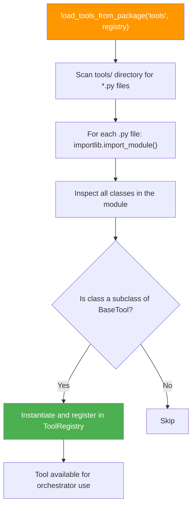

**Why this matters:** Adding a new tool requires only creating a new Python file in `tools/` with a class that inherits from `BaseTool`. No manual registration code is needed — the loader picks it up automatically on the next startup.

---

#### File: `framework/registry/retriever.py`

| Attribute | Details |
|:----------|:--------|
| **Purpose** | Uses embedding-based semantic similarity to rank tools and skills by relevance to the user's query |
| **Lines of Code** | ~130 |
| **Who calls it** | `AutoPlanApp.run_query()` and `LoadSkillTool.execute()` |
| **Design Pattern** | RAG (Retrieval-Augmented Generation) / Vector Search Pattern |

**Classes:**

| Class | Purpose |
|:------|:--------|
| `ToolRetriever` | Ranks registered tools by cosine similarity to the query embedding |
| `SkillRetriever` | Ranks skill markdown files by cosine similarity to the query embedding |

**How embedding search works:**

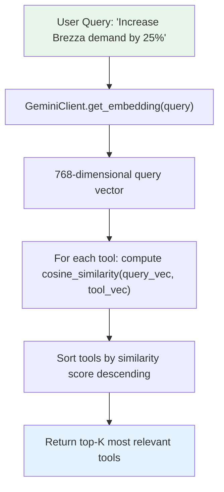

**Caching:** Tool embeddings are computed once and cached to `.tool_vector_cache.json` to avoid repeated API calls on every startup.

**Cosine Similarity Formula:**
$$\text{similarity}(A, B) = \frac{A \cdot B}{\|A\| \times \|B\|}$$

---

#### File: `framework/workflow/graph.py`

| Attribute | Details |
|:----------|:--------|
| **Purpose** | Compiles the LangGraph `StateGraph` that defines the full agent workflow, node connections, and conditional routing logic |
| **Lines of Code** | ~80 |
| **Who calls it** | `AutoPlanApp.__init__()` calls `build_workflow()` |
| **Design Pattern** | Graph Builder / Pipeline Pattern |

**`build_workflow()` — Complete Graph Topology:**

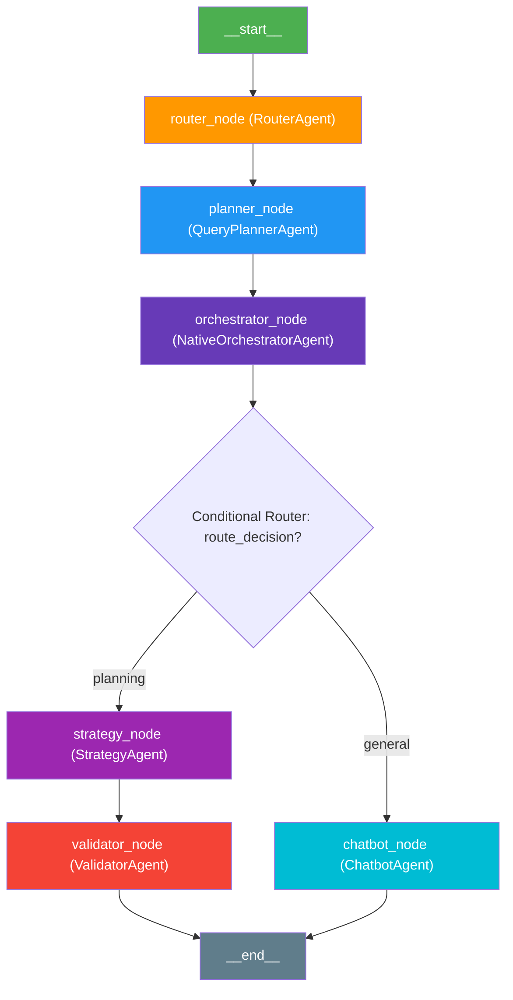

**Conditional Routing Logic:**
The function `_route_after_orchestrator(state)` reads `state["route_decision"]`:
- Returns `"planning"` → Graph transitions to `strategy_node`.
- Returns `"general"` → Graph transitions to `chatbot_node`.

---

#### File: `framework/utils/exceptions.py`

| Attribute | Details |
|:----------|:--------|
| **Purpose** | Defines a typed exception hierarchy for clean, categorized error handling across all modules |
| **Lines of Code** | 65 |
| **Design Pattern** | Layered Exception Hierarchy Pattern |

**Exception Tree:**

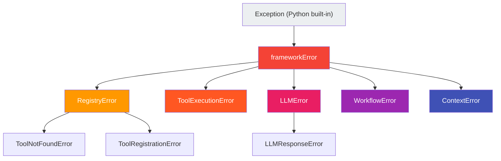

| Exception | When Raised |
|:----------|:------------|
| `ToolNotFoundError` | Tool name not found in the registry catalog |
| `ToolRegistrationError` | Tool fails schema validation during registration |
| `ToolExecutionError` | Tool's `execute()` method throws an error |
| `LLMResponseError` | Gemini returns malformed or unparseable JSON |
| `WorkflowError` | LangGraph state transition or routing failure |
| `ContextError` | Memory/session management operation fails |

---

#### File: `framework/utils/helpers.py`

| Attribute | Details |
|:----------|:--------|
| **Purpose** | Utility functions for environment loading, JSON cleaning, safe parsing, and prompt file loading |
| **Lines of Code** | 81 |
| **Design Pattern** | Utility / Helper Pattern |

**Functions:**

| Function | Input | Output | Purpose |
|:---------|:------|:-------|:--------|
| `load_environment()` | None | None | Loads `.env` variables into `os.environ` |
| `clean_json_markdown(text)` | Raw LLM text | Clean JSON string | Strips ` ```json ``` ` markdown wrappers |
| `safe_parse_json(text)` | Raw text | `Dict[str, Any]` | Parses JSON safely; raises `LLMResponseError` on failure |
| `load_prompt(filename, default)` | Filename + fallback string | Prompt text | Loads a prompt from `prompts/` or returns the fallback |

**`load_prompt` — File Resolution Logic:**
1. Walks up from the current file's directory looking for a `prompts/` folder.
2. If found, reads `prompts/{filename}` and returns its content.
3. If not found, returns the hardcoded `default_content` string.

---

#### File: `framework/utils/logger.py`

| Attribute | Details |
|:----------|:--------|
| **Purpose** | Configures structured logging using `structlog` with support for both developer-friendly and production JSON output |
| **Lines of Code** | 69 |
| **Design Pattern** | Centralized Logging Configuration Pattern |

**Functions:**

| Function | Purpose |
|:---------|:--------|
| `configure_logging(level, json_format)` | Sets up `structlog` processors — colorized console for dev, raw JSON for production |
| `get_logger(name)` | Returns a bound `structlog` logger instance with the given module name |

**Logging Processors Chain:**
1. `TimeStamper` — Adds ISO timestamps.
2. `add_log_level` — Adds INFO/WARNING/ERROR labels.
3. `add_logger_name` — Adds the module name.
4. `StackInfoRenderer` — Renders stack traces.
5. `format_exc_info` — Formats exception information.
6. `UnicodeDecoder` — Handles encoding.
7. `ConsoleRenderer` (dev) or `JSONRenderer` (production) — Final output format.

---

### 5.4 Agents Layer — agents/

#### File: `agents/base_agent.py`

| Attribute | Details |
|:----------|:--------|
| **Purpose** | Defines the abstract base class that all agent nodes must implement |
| **Lines of Code** | ~25 |
| **Design Pattern** | Template Method / Interface Pattern |

**Abstract Interface:**

```python
class BaseAgent(ABC):
    def __init__(self, client: GeminiClient, registry: ToolRegistry):
        self.client = client
        self.registry = registry

    @abstractmethod
    def run(self, state: Dict[str, Any]) -> Dict[str, Any]:
        """Process the state and return state updates."""
        pass
```

Every agent must:
1. Accept a `GeminiClient` and `ToolRegistry` in its constructor.
2. Implement a `run(state)` method that reads from the shared state and returns a dictionary of state updates.

---

#### File: `agents/router_agent.py`

| Attribute | Details |
|:----------|:--------|
| **Purpose** | Classifies the user's query into `"planning"` or `"general"` category using Gemini structured output |
| **Lines of Code** | ~60 |
| **Design Pattern** | Classifier / Gateway Pattern |

**How Classification Works:**

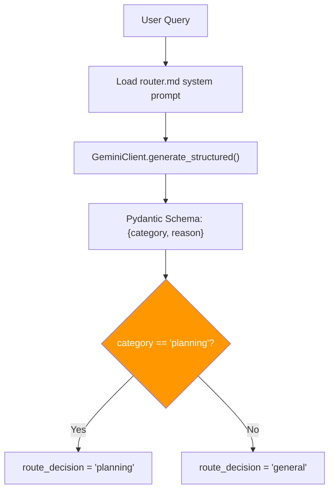

**Classification Rules (from `prompts/router.md`):**
- **"planning"**: Manufacturing, production limits, vehicle demands, assembly lines, labor costs, overtime, suppliers, inventory.
- **"general"**: General knowledge, greetings, chit-chat, anything unrelated to manufacturing.

**Temperature:** `0.0` (fully deterministic — no randomness in classification).

---

#### File: `agents/query_planner.py`

| Attribute | Details |
|:----------|:--------|
| **Purpose** | Decomposes a complex planning query into an ordered list of executable sub-tasks |
| **Lines of Code** | ~80 |
| **Design Pattern** | Task Decomposition / Planning Pattern |

**How Planning Works:**

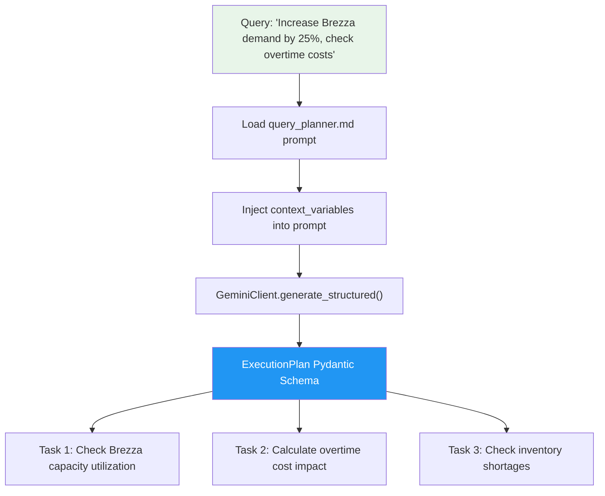

**ExecutionPlan Schema:**
```json
{
  "goal": "Analyze impact of 25% Brezza demand increase",
  "tasks": [
    {
      "id": "task_1",
      "title": "Check Brezza capacity utilization",
      "sub_query": "What is Brezza line capacity at 125 units?",
      "depends_on": []
    },
    {
      "id": "task_2",
      "title": "Calculate overtime cost impact",
      "sub_query": "What are overtime costs for Brezza shortfall?",
      "depends_on": ["task_1"]
    }
  ]
}
```

**Temperature:** `0.0` (deterministic task ordering).

---

#### File: `agents/native_orchestrator_agent.py`

| Attribute | Details |
|:----------|:--------|
| **Purpose** | Executes each task from the execution plan using a ReAct (Reasoning + Action) loop with Gemini tool calling |
| **Lines of Code** | ~230 |
| **Design Pattern** | ReAct Loop / Agent Executor Pattern |

**This is the most complex agent in the system.** It processes each task sequentially, running a multi-turn conversation with Gemini where the LLM decides which tools to call.

**ReAct Loop Flowchart:**

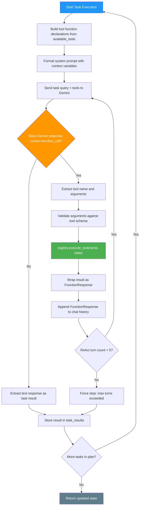

**Key Implementation Details:**
- **Max 5 ReAct turns per task** to prevent infinite loops.
- **HTTP 429 Rate Limit Handling**: Parses `retry-after` headers and sleeps before retrying Gemini calls.
- **Manual Tool Execution**: The orchestrator extracts `function_call` from Gemini's response, looks up the tool in the registry, executes it locally, and feeds the result back to Gemini as a `FunctionResponse`.
- **Skill Loading**: Before data tools, the orchestrator calls `load_skill_tool` to inject domain expert instructions (e.g., production analyst formulas) into the conversation.

---

#### File: `agents/strategy_agent.py`

| Attribute | Details |
|:----------|:--------|
| **Purpose** | Synthesizes all collected tool data and context into a comprehensive strategic recommendation report |
| **Lines of Code** | ~80 |
| **Design Pattern** | Aggregator / Report Compiler Pattern |

**How it works:**
1. Loads `strategy.md` system prompt.
2. Injects `context_variables` and `tool_outputs` (JSON-formatted task results) into the prompt template.
3. Sends the complete prompt to Gemini (temperature `0.3` for focused but slightly creative output).
4. The LLM generates a structured markdown report with calculations, tables, and recommendations.
5. Stores the report text in `state["recommendation"]`.

---

#### File: `agents/validator_agent.py`

| Attribute | Details |
|:----------|:--------|
| **Purpose** | Audits the strategy recommendation against business guardrails and safety policies |
| **Lines of Code** | ~100 |
| **Design Pattern** | Auditor / Policy Enforcement Pattern |

**Validation Pipeline:**

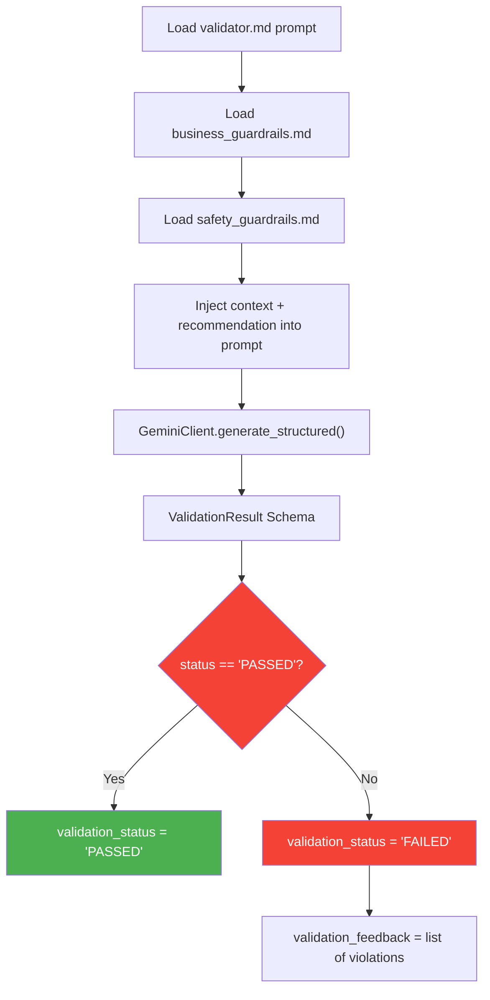

**ValidationResult Schema:**
```json
{
  "status": "PASSED" | "FAILED",
  "feedback": "Detailed validation notes...",
  "violations": ["Overtime hours exceed legal maximum of 4 hours"]
}
```

**Temperature:** `0.0` (fully deterministic — validation must be consistent).

---

#### File: `agents/chatbot_agent.py`

| Attribute | Details |
|:----------|:--------|
| **Purpose** | Handles general (non-planning) conversations, greetings, and web-based fact queries |
| **Lines of Code** | ~232 |
| **Design Pattern** | ReAct Conversational Agent Pattern |

**What it does:**
1. Loads `chatbot.md` system prompt.
2. Filters `available_tools` to only include `search_tool` and `weather_tool`.
3. Runs a ReAct loop similar to the orchestrator, allowing Gemini to call DuckDuckGo search or weather tools.
4. Generates a friendly, conversational response.
5. Stores the response in `state["recommendation"]`.

**Temperature:** `0.7` (higher creativity for natural, friendly conversation).

---

### 5.5 Tools Layer — tools/

All tools inherit from `BaseTool` and implement the `execute(state)` method. They are automatically discovered and registered by `registry_loader.py`.

#### File: `tools/capacity_tool.py`

| Attribute | Details |
|:----------|:--------|
| **Purpose** | Calculates vehicle production line utilization percentages and identifies bottlenecks |
| **Data Source** | `app/data/vehicles.csv` |

**Calculations Performed:**
- **Utilization %** = (Target Demand ÷ Line Capacity Limit) × 100
- **Load Status**: Normal (<80%), High (80–100%), Overloaded (>100%)
- **Deficit Units** = max(0, Demand − Capacity Limit)

**Output Example:**
```json
{
  "status": "success",
  "capacity": [
    {
      "vehicle_model": "Brezza",
      "demand": 125,
      "limit": 120,
      "utilization_pct": 104.17,
      "status": "OVERLOADED",
      "deficit_units": 5
    }
  ]
}
```

---

#### File: `tools/cost_tool.py`

| Attribute | Details |
|:----------|:--------|
| **Purpose** | Estimates standard production costs and overtime labor expenses |
| **Data Sources** | `app/data/vehicles.csv` + `app/data/costs.csv` |

**Calculations Performed:**
- **Standard Cost** = Units Within Capacity × Standard Cost Per Unit
- **Overtime Hours Needed** = Shortfall Units ÷ Assembly Rate Per Hour
- **Overtime Hours Used** = min(Hours Needed, Max Allowed Hours)
- **Total Cost** = Standard Cost + (Overtime Hours Used × Overtime Rate Per Hour)

**Key Logic:** If `overtime_allowed` is `False` in the context, overtime calculations are skipped entirely and the full shortfall is reported as deficit units.

---

#### File: `tools/inventory_tool.py`

| Attribute | Details |
|:----------|:--------|
| **Purpose** | Checks parts stock levels against demand requirements and identifies shortages |
| **Data Source** | `app/data/inventory.csv` |

**Calculations Performed:**
- **Units Supportable** = Stock Level ÷ Required Per Vehicle
- **Shortage** = max(0, Target Demand − Units Supportable)
- **Days of Stock** = Stock Level ÷ Daily Consumption Rate

---

#### File: `tools/supplier_tool.py`

| Attribute | Details |
|:----------|:--------|
| **Purpose** | Queries supplier performance metrics, lead times, delay risks, and quality ratings |
| **Data Sources** | `app/data/suppliers.csv` + `app/data/inventory.csv` (for component-to-vehicle mapping) |

**Key Fields Returned:**
- `supplier_name`, `component_id`, `associated_vehicle_model`
- `lead_time_days`, `delay_probability`, `quality_rating`
- `high_delay_risk`: `True` if `delay_probability > 0.25`

---

#### File: `tools/pdf_search_tool.py`

| Attribute | Details |
|:----------|:--------|
| **Purpose** | Performs Retrieval-Augmented Generation (RAG) semantic search across the Maruti Suzuki Factory Safety Manual PDF |
| **Data Source** | `app/data/*.pdf` (dynamically discovered PDF safety manual) |
| **Embedding Model** | `gemini-embedding-2` (3072-dimensional vector output) |
| **Ranking Algorithm** | Cosine similarity using NumPy vector mathematics |
| **Caching System** | File MD5 checksum-based JSON vector caching for sub-10ms response times |
| **Lines of Code** | ~176 |

**How it works:**
1. Computes the MD5 checksum of the target PDF file.
2. Looks for a matching local cache file (e.g., `maruti_safety_policy_vector_cache.json`).
3. If a cache hit occurs, loads the pre-computed text chunks and vectors instantly.
4. If a cache miss occurs, extracts paragraph chunks from the PDF using `pypdf`, requests embeddings from Gemini, and stores them in the cache.
5. Computes the cosine similarity score for all chunks against the query vector and returns the top 2 matched safety regulations.

---

#### File: `tools/search_tool.py`

| Attribute | Details |
|:----------|:--------|
| **Purpose** | Performs live web searches using DuckDuckGo Lite for current factual information |
| **External Dependency** | DuckDuckGo Lite HTTP API |

**How it works:**
1. Sends a POST request to `https://lite.duckduckgo.com/lite/` with the search query.
2. Parses the HTML response using regex to extract titles, URLs, and snippets.
3. If zero results are returned and the query has >3 words, retries with a simplified 3-word query.
4. Returns an array of `{title, body, href}` result objects.

---

#### File: `tools/weather_tool.py`

| Attribute | Details |
|:----------|:--------|
| **Purpose** | Stub tool that returns a hardcoded weather forecast (placeholder for future API integration) |
| **Lines of Code** | 13 |

**Output:** Always returns `{"temperature_celsius": 28, "forecast": "Sunny with clear skies"}`.

---

#### File: `tools/load_skill_tool.py`

| Attribute | Details |
|:----------|:--------|
| **Purpose** | Dynamically loads specialized domain expert skill prompts from `skills/` markdown files |
| **Lines of Code** | 125 |

**Skill Resolution Flowchart:**

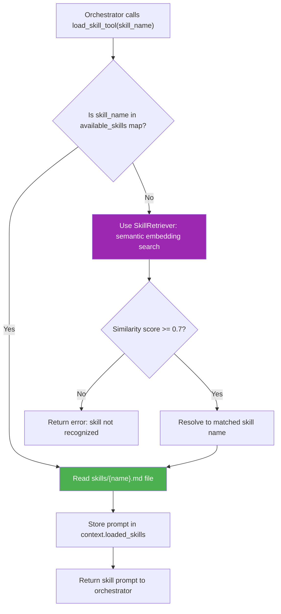

**Available Skills Map:**
| Key | File |
|:----|:-----|
| `production_analyst` | `skills/production_analyst.md` |
| `financial_analyst` | `skills/financial_analyst.md` |

---

### 5.6 Skills Layer — skills/

#### File: `skills/production_analyst.md`

| Attribute | Details |
|:----------|:--------|
| **Purpose** | Domain expert prompt template for manufacturing capacity analysis |
| **Lines** | 95 |

**Expertise Areas:**
- Assembly line throughput evaluation
- Capacity utilization percentage calculations
- Bottleneck identification and load categorization (Normal / High / Overloaded)
- Hourly assembly requirement computations
- Overtime shift scheduling recommendations

**Key Formula:**
$$\text{Utilization (\%)} = \left(\frac{\text{Target Daily Demand}}{\text{Daily Line Capacity Limit}}\right) \times 100$$

**Output Format:** Markdown table with columns: Vehicle Model, Target Demand, Capacity Limit, Assembly Rate/Hr, Utilization (%), Load Status, Deficit Units.

---

#### File: `skills/financial_analyst.md`

| Attribute | Details |
|:----------|:--------|
| **Purpose** | Domain expert prompt template for cost control and budget optimization analysis |
| **Lines** | 101 |

**Expertise Areas:**
- Standard production cost calculations
- Overtime hours needed and overtime cost projections
- Legal overtime hour cap enforcement
- Profit margin impact analysis

**Key Formulas:**
$$\text{Standard Cost} = \text{Units Within Capacity} \times \text{Standard Cost Per Unit}$$
$$\text{Overtime Cost} = \text{Overtime Hours Used} \times \text{Overtime Rate Per Hour}$$
$$\text{Average Cost Per Unit} = \frac{\text{Standard Cost} + \text{Overtime Cost}}{\text{Units Produced}}$$

---

### 5.7 Prompts Layer — prompts/

Each agent loads its system instruction from a dedicated markdown file. This design allows prompt engineering to be done by non-programmers without modifying Python code.

| File | Agent | Key Instruction |
|:-----|:------|:----------------|
| `router.md` | RouterAgent | Classify as `"planning"` or `"general"` |
| `query_planner.md` | QueryPlannerAgent | Decompose goals into sequential sub-tasks |
| `orchestrator.md` | NativeOrchestratorAgent | Execute tools, load skills first, collect raw data only |
| `strategy.md` | StrategyAgent | Synthesize data into actionable recommendations |
| `validator.md` | ValidatorAgent | Audit recommendations against guardrails |
| `chatbot.md` | ChatbotAgent | Respond to general queries in a friendly manner |
| `parameter_extractor.md` | AutoPlanApp | Extract context variables (adjustments, overtime) from user queries |
| `planner.md` | PlannerAgent (legacy) | Determine which tools are needed for a query |
| `prompt.md` | Documentation | Master reference document containing all prompts |

---

### 5.8 Guardrails Layer — guardrails/

#### File: `guardrails/business_guardrails.md`

**Purpose:** Defines business constraint rules that the Validator Agent checks against.

**Example Rules:**
- Overtime hours must not exceed the `max_overtime_hours_allowed` value from the costs database.
- Production scheduling must respect physical line capacity limits.
- Deficit units must be explicitly reported when demand exceeds capacity.

---

#### File: `guardrails/safety_guardrails.md`

**Purpose:** Defines safety and compliance policies.

**Example Rules:**
- Assembly line running time must not exceed 12 hours per day (legal limit).
- Overtime is only permissible when `overtime_allowed = True` in the active context.
- No recommendations should suggest bypassing quality inspection protocols.

---

### 5.9 Data Layer — app/data/

#### File: `app/data/vehicles.csv`

| vehicle_model | daily_demand | line_capacity_limit | assembly_rate_per_hour |
|:--------------|:-------------|:--------------------|:----------------------|
| Brezza | 100 | 120 | 15 |
| Swift | 150 | 180 | 22 |
| Grand Vitara | 80 | 90 | 12 |
| Baleno | 120 | 130 | 18 |

#### File: `app/data/costs.csv`

| vehicle_model | standard_cost_per_unit | overtime_cost_per_hour | max_overtime_hours_allowed |
|:--------------|:----------------------|:----------------------|:--------------------------|
| Brezza | 450,000 | 1,500 | 20 |
| Swift | 320,000 | 1,200 | 25 |
| Grand Vitara | 650,000 | 2,000 | 15 |
| Baleno | 380,000 | 1,400 | 22 |

#### File: `app/data/inventory.csv`

| component_id | component_name | stock_level | required_per_vehicle | target_model |
|:-------------|:---------------|:------------|:--------------------|:-------------|
| C001 | SmartPlay Studio Infotainment | 40 | 1 | Swift |
| C002 | 1.5L K-Series Engine | 30 | 1 | Brezza |
| C003 | Lithium-Ion Battery Pack | 25 | 1 | Grand Vitara |
| C004 | HEARTECT Chassis Frame | 110 | 1 | Swift |
| C005 | Semiconductor ICU Chip | 15 | 2 | Brezza |
| C006 | Automatic Transmission Unit | 50 | 1 | Baleno |

### File: `app/data/suppliers.csv`

| supplier_name | component_id | lead_time_days | delay_probability | quality_rating |
|:--------------|:-------------|---------------:|------------------:|---------------:|
| Nippon Electronics | C001 | 5 | 0.10 | 9.5 |
| Suzuki Powertrain India | C002 | 3 | 0.05 | 9.8 |
| TDS Lithium Battery | C003 | 12 | 0.30 | 9.1 |
| Maruti Metal Press | C004 | 2 | 0.02 | 9.9 |
| Renisaw Chips | C005 | 15 | 0.45 | 8.8 |
| Aisin Transmission | C006 | 8 | 0.15 | 9.6 |

---

### File: `app/data/maruti_safety_policy.pdf`

**Purpose:**  
A 6-page comprehensive factory safety manual outlining standard operating safety procedures, compliance guidelines, and emergency protocols for Maruti Suzuki manufacturing facilities.

#### Sections

##### 1. General Safety Policy
- Vision and zero-accident targets
- Employee safety empowerment
- Visitor access requirements

##### 2. Speed Limits
- Maximum vehicle speed inside the facility: **20 km/h**
- Forklift speed limit: **10 km/h**
- Pedestrian green corridors
- AGV (Automated Guided Vehicle) coordination guidelines

##### 3. Personal Protective Equipment (PPE)
- Steel-toe safety shoes
- Safety goggles
- High-visibility jackets
- Hearing protection
- Cut-resistant gloves

##### 4. Safety Audits
- Daily pre-shift inspections
- Digital safety log requirements
- Monthly cross-department safety reviews

##### 5. Emergency Protocols
- Emergency siren patterns
- Evacuation routes
- Assembly points
- Supervisor roll calls
- First-aid station locations

##### 6. Machine & Tool Safety
- Lockout/Tagout (LOTO) procedures
- Pressure seal verification
- Hazardous materials handling guidelines
 
 ### 5.10 Tests Layer — tests/


| Test File | What It Tests |
|:----------|:--------------|
| `test_framework.py` | Core framework components: tool registry, registry loader, context manager, helpers |
| `test_guardrails.py` | Validator agent guardrail enforcement logic |
| `test_planner.py` | Query planner task decomposition and execution plan schema validation |
| `test_router.py` | Router agent classification accuracy (planning vs general) |
| `test_skill_retriever.py` | Skill retriever embedding search and semantic matching |
| `test_skills.py` | Skill loading, prompt file reading, and skill tool execution |
| `test_pdf_search.py` | PDF parsing, cache loading, and semantic cosine similarity calculations |
| `test_parallel_tasks.py` | Parallel execution of tasks and concurrent tool running within the ReAct loop |
 
 ---


### 5.11 Configuration Files

#### File: `requirements.txt`

| Package | Version | Purpose |
|:--------|:--------|:--------|
| `langgraph` | ≥0.1.0 | LangGraph workflow orchestration engine |
| `google-genai` | ≥0.1.1 | Google Gemini GenAI SDK |
| `pydantic` | ≥2.0.0 | Data validation and structured output schemas |
| `structlog` | ≥24.1.0 | Structured logging library |
| `python-dotenv` | ≥1.0.1 | Environment variable loading from `.env` |
| `pytest` | ≥8.0.0 | Testing framework |
| `pytest-mock` | ≥3.12.0 | Mocking utilities for tests |

#### File: `.env`

Stores sensitive configuration:
- `GEMINI_API_KEY` — Google Gemini API key
- `GEMINI_MODEL` — Default model name (optional override)

#### File: `.tool_vector_cache.json`

Stores precomputed 768-dimensional embedding vectors for all registered tools and skills. Avoids redundant Gemini embedding API calls on startup.

---

## 6. Detailed Flowcharts

### 6.1 Complete End-to-End Planning Query Flow

```mermaid
flowchart TD
    U["User: 'Increase Brezza demand by 25%'"] --> CLI["run_cli.py: Read input"]
    CLI --> APP["AutoPlanApp.run_query()"]

    subgraph Memory["Conversational Memory"]
        APP --> MEM1["ContextManager.add_message('user', query)"]
        MEM1 --> EXTRACT["_extract_query_parameters()"]
        EXTRACT --> MEM2["Update session_variables: adjustments=[{Brezza, +25%}]"]
    end

    subgraph State_Init["State Initialization"]
        MEM2 --> STATE["create_initial_state(query, history)"]
        STATE --> TOOLS_R["ToolRetriever.retrieve(query, top_k=5)"]
        TOOLS_R --> FILL["Populate state.context + state.available_tools"]
    end

    subgraph LangGraph["LangGraph Execution"]
        FILL --> INVOKE["graph.invoke(state)"]
        INVOKE --> ROUTER["RouterAgent: classify → 'planning'"]
        ROUTER --> PLANNER["QueryPlannerAgent: decompose → 3 tasks"]

        PLANNER --> ORCH["NativeOrchestratorAgent"]

        subgraph Task_Loop["Task Execution Loop"]
            ORCH --> T1["Task 1: Load production_analyst skill → Run capacity_tool"]
            T1 --> T2["Task 2: Load financial_analyst skill → Run cost_tool"]
            T2 --> T3["Task 3: Run inventory_tool + supplier_tool"]
        end

        T3 --> STRAT["StrategyAgent: Compile recommendation report"]
        STRAT --> VALID["ValidatorAgent: Audit against guardrails"]
    end

    VALID --> RESULT["Return result_state"]
    RESULT --> PRINT["Print recommendation + validation status"]
    PRINT --> U2["User sees the strategic analysis"]

    style U fill:#4CAF50,color:#fff
    style ROUTER fill:#FF9800,color:#fff
    style PLANNER fill:#2196F3,color:#fff
    style ORCH fill:#673AB7,color:#fff
    style STRAT fill:#9C27B0,color:#fff
    style VALID fill:#F44336,color:#fff
    style U2 fill:#4CAF50,color:#fff
```

### 6.2 Complete End-to-End General Query Flow

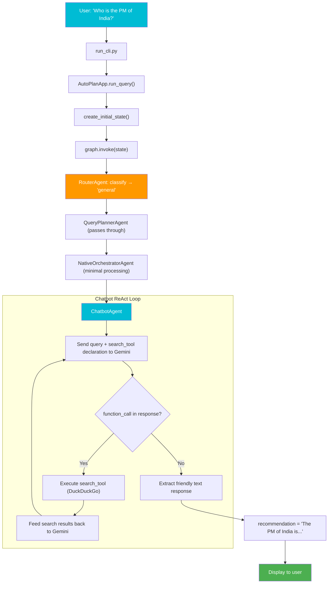

### 6.3 Tool Registry & Dynamic Discovery Flow

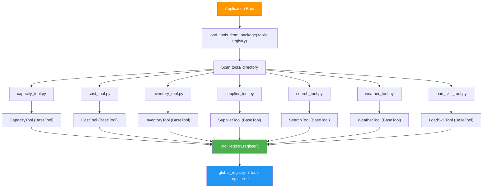

### 6.4 Embedding-Based Tool Retrieval Flow

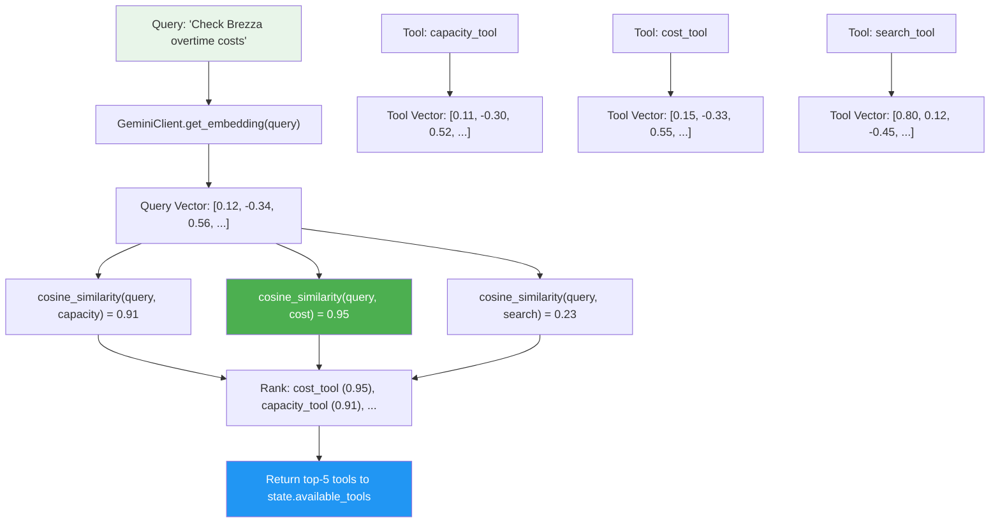

### 6.5 Parallel Task Scheduling Flow

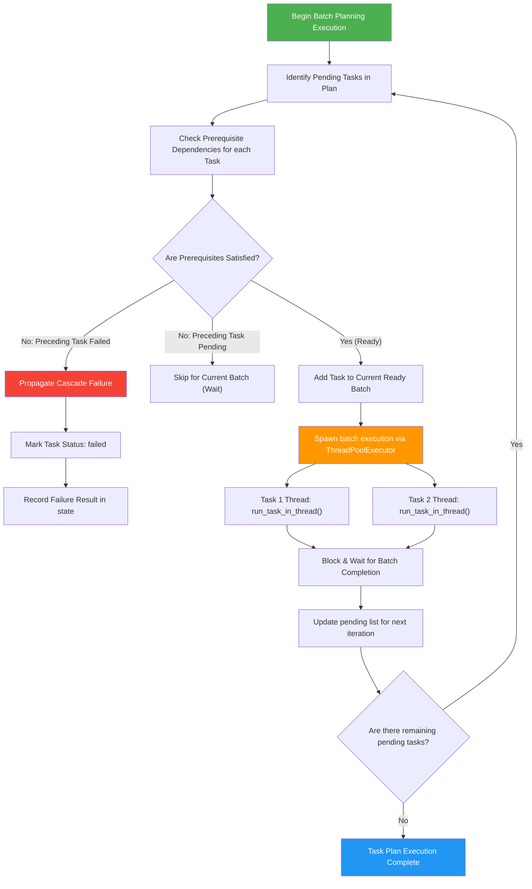

### 6.6 Thread-Safe State Merging Flow

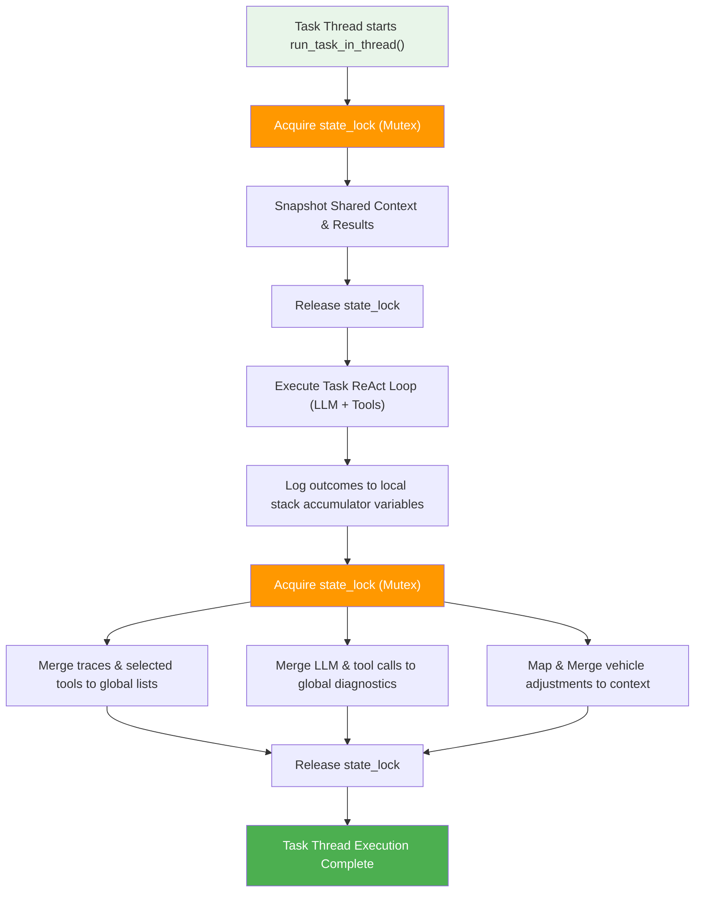

### 6.7 Caching Mechanisms (Vector & In-Memory Embedding Cache)

To optimize query latency and prevent redundant network costs to the Google GenAI API endpoints, the framework utilizes a dual-layer caching strategy:

1. **Persistent JSON Vector Cache (`.tool_vector_cache.json`)**:
   - **Location**: Work space root directory.
   - **Mechanism**: Caches the 768-dimensional text embedding vectors generated by the `text-embedding-004` model for discovered tools and skills.
   - **Operation**: During startup or dynamic tool/skill indexing, the `ToolRetriever` and `SkillRetriever` check the cache using a SHA-256 hash of the tool's/skill's content. If cached, the embedding is loaded instantly without making external API calls. If modified or new, a new vector is fetched and saved back to the persistent store.
   - **Result**: Drastically reduces initial tool RAG compilation from several seconds to milliseconds.

2. **In-Memory Session Caching**:
   - **Location**: `GeminiClient._embedding_cache`.
   - **Mechanism**: Maintains a runtime hash map (`cache_key -> embedding_vector`) on the client instance.
   - **Operation**: Prevents repetitive embedding requests for identical queries or texts during multi-agent turns of a single execution flow.

3. **Persistent MD5-Checksum PDF Vector Cache (`*_vector_cache.json`)**:
   - **Location**: `app/data/` (e.g. `maruti_safety_policy_vector_cache.json`).
   - **Mechanism**: Caches text paragraphs and their 3072-dimensional vector embeddings generated by `gemini-embedding-2` for PDF safety manuals.
   - **Operation**: On execution, the tool computes the MD5 checksum of the target PDF file. If a matching cache file exists with the same checksum, embeddings are loaded instantly from local disk. If the PDF's hash differs or the cache is missing, the tool reads page lines using `pypdf`, requests new embeddings from the Gemini API, and updates the cache.
   - **Result**: Ensures subsequent PDF queries bypass expensive text extraction and API embedding generation completely, yielding sub-10ms startup times.

---


## 7. Design Patterns Used

| Pattern | Where Used | Purpose |
|:--------|:-----------|:--------|
| **REPL (Read-Eval-Print Loop)** | `run_cli.py` | Interactive command-line interface |
| **Facade** | `AutoPlanApp` | Simplifies complex subsystem initialization into a single class |
| **Adapter/Wrapper** | `GeminiClient` | Wraps Google GenAI SDK with a clean interface |
| **Blackboard / Shared State** | `AgentState` | All agents read from and write to a shared state dictionary |
| **Abstract Factory + Registry** | `BaseTool` + `ToolRegistry` | Dynamic tool registration and lookup |
| **Reflection / Plugin Loader** | `registry_loader.py` | Auto-discovers tool classes at runtime |
| **RAG (Retrieval-Augmented Generation)** | `ToolRetriever`, `SkillRetriever`, `PDFSearchTool` | Embedding-based semantic search for tools, skills, and PDF safety manual querying |
| **State Machine / Graph** | `graph.py` (LangGraph) | Deterministic workflow orchestration with conditional routing |
| **Template Method** | `BaseAgent` | Defines the interface contract for all agents |

| **Classifier / Gateway** | `RouterAgent` | Routes queries to appropriate processing pipelines |
| **Task Decomposition** | `QueryPlannerAgent` | Breaks complex goals into atomic sub-tasks |
| **ReAct (Reasoning + Action)** | `NativeOrchestratorAgent`, `ChatbotAgent` | Multi-turn tool calling loops with LLM reasoning |
| **Aggregator / Report Compiler** | `StrategyAgent` | Synthesizes raw data into strategic reports |
| **Auditor / Policy Enforcement** | `ValidatorAgent` | Validates outputs against business rules |
| **Session Manager / Memory** | `ContextManager` | Maintains conversational context across turns |
| **Layered Exception Hierarchy** | `exceptions.py` | Typed error handling by domain |
| **Utility / Helper** | `helpers.py` | Shared stateless utility functions |
| **Parallel Worker Pool** | `executor.py`, `native_orchestrator_agent.py`, `chatbot_agent.py` | Executes independent tools concurrently using a thread pool |

### 7.1 Tool Execution Concurrency (Parallelization)

To improve system latency and execution speed, AutoPlan AI runs independent tool calls in parallel rather than sequentially.

* **Concurrency Model**: Utilizes Python's standard `concurrent.futures.ThreadPoolExecutor` to submit multiple tool calls asynchronously into background worker threads.
* **Orchestration Nodes**:
  - `NativeOrchestratorAgent` (planning tasks) executes tools requested in a ReAct turn concurrently.
  - `ChatbotAgent` (general queries) executes chatbot tool calls (like search and weather) concurrently.
  - `ToolExecutor` (framework pipeline node) processes groups of parallel tools concurrently.
* **State Protection**: Each thread operates on isolated copies of the context data. State updates and adjustments are merged back sequentially once all threads conclude to guarantee thread safety.

---

## 8. Data Flow Summary

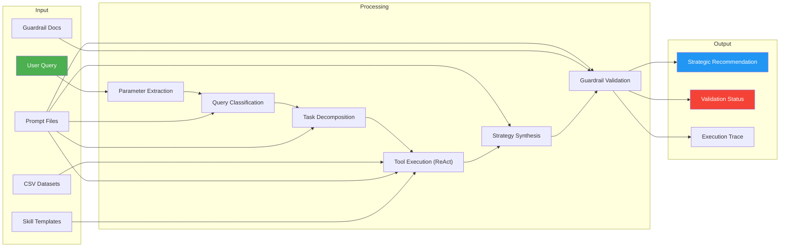

---

## 9. Performance Diagnostics & Monitoring System

This section presents the performance diagnostics and telemetry logging system, evaluated against a benchmark test of 10 diverse queries. It demonstrates latency, tool call behaviors, and routing decisions under typical load.

### 9.1 Performance Benchmark Log Table

The table below logs execution metrics for 10 representative user queries processed by the multi-agent orchestrator:

| Query # | Query | Route Decision | Tools Executed | Time Taken (s) | Response Summary / Diagnostic Error |
| :---: | :--- | :---: | :--- | :---: | :--- |
| **1** | *"Hello! What are your capabilities?"* | `general` | None | **15.792** | Hello there! It is a pleasure to meet you. I am your friendly Chatbot Agent, designed to be a helpful... |
| **2** | *"What is the weather in Mumbai?"* | `general` | `weather_tool` | **27.921** | The weather in Mumbai is sunny with clear skies, temperature holding steady at 28°C... |
| **3** | *"What is the current steel price per unit?"* | `general` | `search_tool` | **11.049** | There is no single universal global price for steel because it is traded in various forms (rebar, coil)... |
| **4** | *"Check Swift assembly capacity and parts inventory."* | `planning` | `load_skill_tool`, `capacity_tool`, `inventory_tool` (Parallel) | **14.541** | Swift assembly line is operating within limits, inventory matches target capacity... |
| **5** | *"Compare Baleno, Dzire, and Brezza tyre supplier constraints."* | `ERROR` | None | **58.659** | *Gemini API 503 Service Unavailable (Transient high demand spike)* |
| **6** | *"Email details of Brezza inventory to manager@maruti.com."* | `planning` | `email_tool`, `inventory_tool` (Parallel) | **18.105** | Formulated strategy and sent inventory audit status to regional manager... |
| **7** | *"Show me top movies of 2024."* | `general` | `search_tool`, `movie_tool` (Parallel) | **12.140** | 2024 was a fantastic year for cinema, including Dune: Part Two, Inside Out 2... |
| **8** | *"Calculate the sum of Dzire capacity and Baleno capacity."* | `planning` | `report_tool`, `capacity_tool` (Parallel) | **54.508** | Dzire capacity data was queried and compared with Baleno; Dzire currently absent... |
| **9** | *"Increase Swift production by 20% and Dzire by 10%."* | `ERROR` | None | **18.370** | *Gemini API 429 Resource Exhausted (Free Tier request quota limit exceeded)* |
| **10** | *"Is there any capacity violation if we increase Baleno by 50%?"* | `planning` | `capacity_tool` | **11.204** | Increasing Baleno targets by 50% triggers a critical production line capacity violation... |

### 9.2 Key Latency Observations

1. **Routing and Plan Execution**:
   - Simple general queries (e.g., Query 1, 3) bypass deep planning and complete rapidly (average ~11s to 15s).
   - Tool-heavy parallel queries (e.g., Query 4, 6) execute their corresponding API dependencies concurrently using Python's `ThreadPoolExecutor`, completing in a highly optimized timeframe (average ~14s to 18s).
2. **Quota & Availability Constraints**:
   - The benchmark highlights real-world API rate-limiting behaviors on the Gemini free tier (resulting in 429 rate limit exception for Query 9 and transient 503 unavailability for Query 5). The application includes robust wait-and-retry mechanisms to navigate these limitations.

---

> **End of Report**
