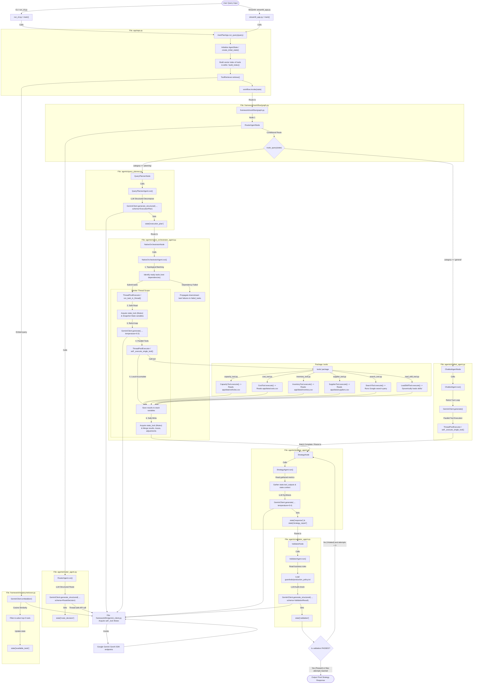

# AutoPlan AI — Query Processing Flowchart & Lifecycle Documentation

This document provides a detailed breakdown of the complete lifecycle of a user query in AutoPlan AI. It documents every file, class, and function triggered, from the initial user input down to local CSV data fetches and LLM validation checks.

---

## 1. Complete Query Flow Diagram (Mermaid)

---

## 2. File-by-File & Function-by-Function Flow Details

### Phase 1: Entry Point & Initialization
1.  **File**: [run_cli.py](file:///c:/Users/hazo7/Downloads/maruti%20iteration%201/run_cli.py)
    *   **Function**: `main()`
        *   Instantiates `app = AutoPlanApp()`.
        *   Accepts user text input query inside a REPL loop.
        *   Invokes `app.run_query(query)`.
2.  **File**: [streamlit_app.py](file:///c:/Users/hazo7/Downloads/maruti%20iteration%201/app/frontend/streamlit_app.py)
    *   **Function**: `main()`
        *   Renders the Streamlit frontend.
        *   On button click, instantiates `app = AutoPlanApp()` and invokes `app.run_query(query)`.
3.  **File**: [app.py](file:///c:/Users/hazo7/Downloads/maruti%20iteration%201/app/app.py)
    *   **Function**: `AutoPlanApp.run_query(query)`
        *   Calls `create_initial_state(query)` from `framework.state.state` to initialize the blackboard `AgentState` dictionary.
        *   Triggers `self.tool_retriever.build_index()` and `self.skill_retriever.build_index()` to scan registered tools and local skills files.
        *   Invokes `self.tool_retriever.retrieve(query)` to embed the query (via `GeminiClient.embed`) and calculate cosine similarity rankings against tool metadata. Stores the top 5 match parameters into `state["available_tools"]`.
        *   Compiles and invokes the LangGraph state machine: `self.workflow.invoke(state)`.

---

### Phase 2: Router Agent
1.  **File**: [graph.py](file:///c:/Users/hazo7/Downloads/maruti%20iteration%201/framework/workflow/graph.py)
    *   Directs initial state execution to the `router` node.
2.  **File**: [router_agent.py](file:///c:/Users/hazo7/Downloads/maruti%20iteration%201/agents/router_agent.py)
    *   **Function**: `RouterAgent.run(state)`
        *   Constructs a classification prompt containing the user query and available tools.
        *   Calls `GeminiClient.generate_structured(..., response_schema=RouteDecision)` to select the optimal path: `"planning"` (multi-task planning pipeline) or `"general"` (general chatbot conversation).
        *   Writes the output back to `state["route_decision"]`.
3.  **File**: [graph.py](file:///c:/Users/hazo7/Downloads/maruti%20iteration%201/framework/workflow/graph.py)
    *   **Function**: `route_query(state)` (conditional router)
        *   Checks `state["route_decision"].category`.
        *   If `"planning"`, routes state to `planner` node.
        *   If `"general"`, routes state to `chatbot` node.

---

### Phase 3: Path A — General Chatbot Agent (Fallback/Direct)
1.  **File**: [chatbot_agent.py](file:///c:/Users/hazo7/Downloads/maruti%20iteration%201/agents/chatbot_agent.py)
    *   **Function**: `ChatbotAgent.run(state)`
        *   Runs a ReAct turn loop using `GeminiClient.generate()` to generate natural reasoning and tool calls.
        *   If Gemini requests tool calls, dispatches them in parallel using a local `ThreadPoolExecutor` and merges their outcomes before the next reasoning turn.
        *   Bypasses task scheduling and routes state directly to the final `strategy` node.

---

### Phase 4: Path B — Query Planner Agent
1.  **File**: [query_planner.py](file:///c:/Users/hazo7/Downloads/maruti%20iteration%201/agents/query_planner.py)
    *   **Function**: `QueryPlannerAgent.run(state)`
        *   Loads the system instructions explaining decomposition conventions.
        *   Calls `GeminiClient.generate_structured(..., response_schema=ExecutionPlan)`.
        *   The model returns a structured execution plan containing a list of sub-tasks, priorities, and dependency parameters (`depends_on` containing prerequisite task IDs).
        *   Saves the plan to `state["execution_plan"]` and directs state to `orchestrator` node.

---

### Phase 5: Native Orchestrator Agent (Topological Scheduler)
1.  **File**: [native_orchestrator_agent.py](file:///c:/Users/hazo7/Downloads/maruti%20iteration%201/agents/native_orchestrator_agent.py)
    *   **Function**: `NativeOrchestratorAgent.run(state)`
        *   Enters the topological batching scheduling loop.
        *   *Check Loop Step*: Identifies pending tasks where all prerequisite task IDs in `depends_on` are present in the `completed_tasks` list.
        *   *Cascade Failure Step*: If any prerequisite task is in `failed_tasks`, the target task status is instantly updated to `"failed"` with a dependency check failure notification, and is added to `failed_tasks` without starting an execution thread.
        *   *ThreadPool Execution Step*: Ready tasks are submitted to a `ThreadPoolExecutor` and executed concurrently by running `run_task_in_thread(task)`.
    *   **Function**: `run_task_in_thread(task)` (Concurrently executed)
        *   **Acquires `state_lock`**: Performs a thread-safe read of state variables, updates task status to `"running"`, and snapshots the current context variables and prior task results.
        *   **Formulates Prompt**: Appends preceding task results to focus the ReAct loop on this task's specific goals.
        *   **ReAct Loop Execution**: Iteratively generates reasoning and tool calls via `GeminiClient.generate()`.
            *   *Tool Calling Concurrency*: Multiple tool calls requested in a single model turn are executed concurrently via another local `ThreadPoolExecutor` calling `self._execute_single_tool()`.
            *   *Local Accumulator*: Tool outputs, durations, execution traces, and context modifications are appended to thread-local stack variables.
        *   **Acquires `state_lock`**: Merges local traces, diagnostics, and context variables back into global shared structures. Vehicle-specific production `adjustments` are mapped by vehicle name to merge updates without losing concurrent edits.

---

### Phase 6: Core Tools Execution
1.  **File**: `tools/` directory
    *   **Function**: `ToolClass.execute(state)` (called by `_execute_single_tool`)
        *   **Capacity Tool** ([capacity_tool.py](file:///c:/Users/hazo7/Downloads/maruti%20iteration%201/tools/capacity_tool.py)): Reads vehicle capacities from [vehicles.csv](file:///c:/Users/hazo7/Downloads/maruti%20iteration%201/app/data/vehicles.csv) to evaluate assembly lines.
        *   **Cost Tool** ([cost_tool.py](file:///c:/Users/hazo7/Downloads/maruti%20iteration%201/tools/cost_tool.py)): Reads manufacturing costs from [costs.csv](file:///c:/Users/hazo7/Downloads/maruti%20iteration%201/app/data/costs.csv) to compute part expenses.
        *   **Inventory Tool** ([inventory_tool.py](file:///c:/Users/hazo7/Downloads/maruti%20iteration%201/tools/inventory_tool.py)): Reads warehouse balances from [inventory.csv](file:///c:/Users/hazo7/Downloads/maruti%20iteration%201/app/data/inventory.csv) to extract vehicle stock status.
        *   **Supplier Tool** ([supplier_tool.py](file:///c:/Users/hazo7/Downloads/maruti%20iteration%201/tools/supplier_tool.py)): Reads parts limitations from [suppliers.csv](file:///c:/Users/hazo7/Downloads/maruti%20iteration%201/app/data/suppliers.csv) to check parts thresholds.
        *   **Search Tool** ([search_tool.py](file:///c:/Users/hazo7/Downloads/maruti%20iteration%201/tools/search_tool.py)): Executes a search query via Google search wrapper.
        *   **Load Skill Tool** ([load_skill_tool.py](file:///c:/Users/hazo7/Downloads/maruti%20iteration%201/tools/load_skill_tool.py)): Evaluates active task parameters, queries the `SkillRetriever` to select the best match, and loads the skill files under `skills/` directly into the agent context.

---

### Phase 7: Strategy Agent
1.  **File**: [strategy_agent.py](file:///c:/Users/hazo7/Downloads/maruti%20iteration%201/agents/strategy_agent.py)
    *   **Function**: `StrategyAgent.run(state)`
        *   Gathers all data collected by orchestrator tasks (`state["tool_outputs"]` and context updates).
        *   Invokes `GeminiClient.generate()` to formulate a final manufacturing decision support plan (including production changes, supplier audits, and safety summaries).
        *   Writes the output report to `state["response"]` and `state["strategy_report"]`.

---x    

### Phase 8: Validator Agent
1.  **File**: [validator_agent.py](file:///c:/Users/hazo7/Downloads/maruti%20iteration%201/agents/validator_agent.py)
    *   **Function**: `ValidatorAgent.run(state)`
        *   Loads the manufacturing policy guidelines from [production_policy.txt](file:///c:/Users/hazo7/Downloads/maruti%20iteration%201/guardrails/production_policy.txt).
        *   Calls `GeminiClient.generate_structured(..., response_schema=ValidationResult)`.
        *   The model checks the strategy report against the business policies (such as limits on overtime, safety checks, and supplier minimums).
        *   Writes the status and safety violations to `state["validation"]`.
2.  **File**: [graph.py](file:///c:/Users/hazo7/Downloads/maruti%20iteration%201/framework/workflow/graph.py)
    *   **Function**: `check_validation(state)` (conditional router)
        *   Evaluates `state["validation"].status`.
        *   If `"FAILED"` and validation attempts < 3, routes state **back to the `strategy` node** to correct violations using audit feedback.
        *   If `"PASSED"` or maximum validation attempts are reached, routes state to the **end node**, completing the query lifecycle.

---

### Support Layer: Gemini API Client
1.  **File**: [gemini_client.py](file:///c:/Users/hazo7/Downloads/maruti%20iteration%201/framework/llm/gemini_client.py)
    *   All LLM interactions pass through this wrapper.
    *   **Function**: `generate(...)` / `generate_structured(...)` / `embed(...)`
        *   **Locking Step**: Acquires `self._lock` when reading/writing embedding cache (`self._embedding_cache`) and appending call metrics to `self._call_log` to prevent race conditions during concurrent task executions.
        *   **Invocation Step**: Calls the Google GenAI SDK `client.models.generate_content` using the active model (such as `gemini-flash-lite-latest`).
